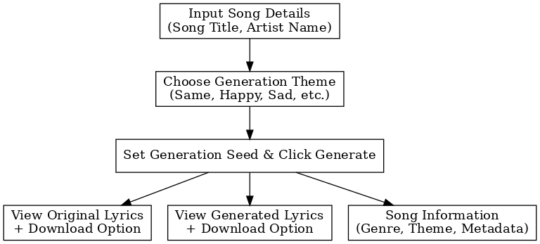

# 🎶 AI Lyrics Generator

## Overview

The **AI Lyrics Generator** is a tool that allows users to generate new lyrics based on existing songs. By providing a song title and artist name, and choosing a theme (e.g., happy, sad, or same), the app produces AI-generated lyrics matching the selected tone. Users can view and download both the original and generated lyrics along with additional song information.

---

## 🔄 Workflow

1. **Input Song Details**  
   - Enter the song title and artist name.

2. **Choose Generation Theme**  
   - Select the desired emotion/mood for the new lyrics:
     - Same (original tone)
     - Happy
     - Sad
     - Other (if supported)

3. **Set Generation Seed & Click Generate**  
   - Optionally set a seed for reproducibility.
   - Click the **Generate** button.

4. **View Results**  
   - View and download the following:
     - Original Lyrics
     - Generated Lyrics
     - Song Information (Genre, Theme, Metadata)

---

## 💡 Features

- 🎵 AI-powered lyrics generation
- 🎭 Mood/theme customization (happy, sad, same, etc.)
- 📄 Downloadable lyrics (original and generated)
- 📊 Metadata extraction (genre, theme, artist details)

---

